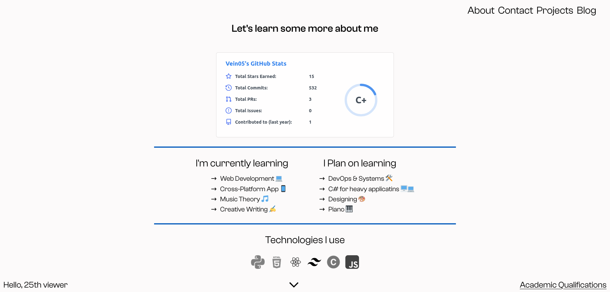

# Portfolio Website

This repository contains the code for my personal portfolio website. The website showcases my projects, skills, and experience.

## Technologies Used

The portfolio website is built using the following technologies:

- **React**: A JavaScript library for building user interfaces.
- **Tailwind CSS**: A highly customizable CSS framework.

## Features

- **Project Showcase**: Display your projects with images, descriptions, and links.
- **Skills Section**: Highlight your skills and expertise in a visually appealing manner.
- **Experience**: Showcase your work experience and education.
- **Contact**: Provide a contact form or relevant information for visitors to get in touch with you.

## Installation

1. Clone this repository to your local machine using 
`git clone https://github.com/vein05/portfolio.git`
2. Navigate to the project directory: `cd portfolio`
3. Install the dependencies: `npm install`

## Usage

1. Start the development server: `npm start`
2. Open your browser and visit `http://localhost:3000` to view the website.

## Screenshots

## Contributing

Contributions are welcome! If you have any suggestions, bug reports, or feature requests, please open an issue or submit a pull request.

## License

This project is licensed under the [MIT License](LICENSE).

---

Built with ❤️ using React and Tailwind CSS.
