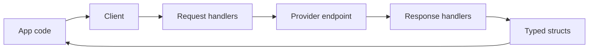

# Creating the Most Popular Deepseek API Client in Go (Part 1): Why I Built deepseek-go

I did not start `deepseek-go` because I wanted to maintain another SDK.
I started it because I needed a Go client I could trust in production.

At the time, I needed four things in one package:

1. Type-safe request/response contracts.
2. Streaming that did not feel bolted on.
3. Provider flexibility (DeepSeek, Azure/OpenRouter-style endpoints, local Ollama).
4. A codebase that contributors could understand quickly.

```image
src: /.netlify/images?url=/posts/images/creating-most-popular-deepseek-api-client-go-part-1/deepseek-go-big.png&w=1400&fit=cover
alt: deepseek-go logo from project README
caption: The project branding I used in the README while shaping deepseek-go's identity.
layout: wide
```

## The practical problem I wanted to solve

I kept seeing teams wrap LLM HTTP APIs with throwaway utilities. It works for week one, then quality drops:

- auth handling gets inconsistent,
- model/provider branching becomes copy-paste,
- streaming paths diverge from non-streaming paths,
- error surfaces become ambiguous.

So I treated this SDK like production infrastructure, not demo code.

## The first architecture decision

I separated concerns early:

- `client` concerns: auth, base URL, path, timeout, HTTP transport.
- `request` concerns: constructing payloads and dispatching requests.
- `response` concerns: decoding success/error consistently.
- `feature` concerns: chat, stream, FIM, JSON extraction, model listing, balance.



That structure made the package easier to test and easier to evolve.

## Why Go was the right language for this

For this SDK, Go gave me exactly what I needed:

- predictable performance,
- explicit types for API contracts,
- straightforward concurrency for stream consumers,
- a tooling baseline that contributors already trust.

I leaned hard into those strengths instead of trying to mimic dynamic SDK ergonomics.

## What I optimized for from day one

### 1. Explicitness over magic

I wanted users to see exactly what they were sending.
That is why request structs stay direct and readable.

```go
request := &deepseek.ChatCompletionRequest{
    Model: deepseek.DeepSeekChat,
    Messages: []deepseek.ChatCompletionMessage{
        {Role: deepseek.ChatMessageRoleSystem, Content: "Answer every question using slang."},
        {Role: deepseek.ChatMessageRoleUser, Content: "Which is the tallest mountain in the world?"},
    },
}
```

### 2. Stream-first reliability

Streaming APIs fail in subtle ways if lifecycle management is sloppy.
I made sure stream handling had a clear `Recv()` loop + `Close()` semantics.

```go
stream, err := client.CreateChatCompletionStream(ctx, request)
if err != nil {
    log.Fatal(err)
}
defer stream.Close()
```

### 3. Configuration that scales with complexity

The `NewClientWithOptions(...)` API came from a practical need: avoid constructor explosions when features grow.

## How I viewed adoption from the beginning

I never thought, "I need to make this famous."
I thought, "If this package is stable under real pressure, adoption follows."

That mindset changed how I shipped:

- fewer flashy abstractions,
- more boring correctness,
- aggressive documentation and examples,
- contributor-friendly internals.

## Personal note

One thing I learned quickly: once an SDK is public, users will rely on edge paths you did not design first.
That forced me to write for maintainability from the start, because every shortcut becomes an obligation later.

```image
src: /.netlify/images?url=/posts/images/creating-most-popular-deepseek-api-client-go-part-1/deepseek-go.png&w=800&fit=cover
alt: deepseek-go circular logo from project README
caption: By the time this logo existed, the code architecture already had to support multiple providers and growing community usage.
layout: narrow
```

---

In Part 2, I break down the technical internals: request pipeline, streaming, FIM/beta endpoints, and how provider compatibility actually works without making the API messy.
