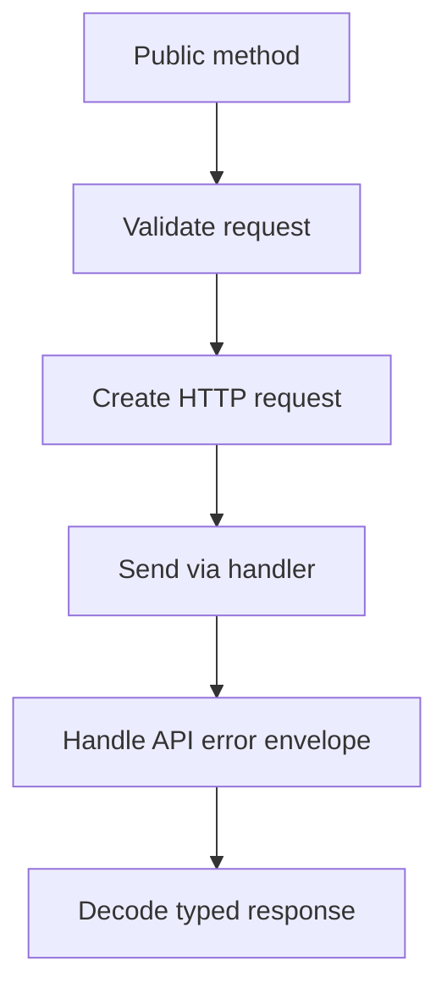

# Creating the Most Popular Deepseek API Client in Go (Part 2): Architecture and API Design

Part 1 was about motivation. This part is about implementation.

When I designed `deepseek-go`, I wanted the public API to feel simple while keeping internals composable enough for new features.

## Client construction strategy

I ship two main construction paths:

1. `NewClient(token, baseURL...)` for quick setup.
2. `NewClientWithOptions(token, opts...)` for explicit control.

That split keeps onboarding easy while still supporting advanced setups.

```go
client, err := deepseek.NewClientWithOptions("your-api-key",
    deepseek.WithBaseURL("https://custom-api.com/"),
    deepseek.WithTimeout(10*time.Second),
)
if err != nil {
    log.Fatalf("Error creating client: %v", err)
}
```

For local model servers that do not require auth, I added `WithoutAPIKeyValidation()` because forcing fake keys is bad DX.

## FAQ: How does pkg.go.dev track new Go package versions?

What I learned (and now plan releases around):

- `pkg.go.dev` gets module/version data from `proxy.golang.org`.
- It monitors `index.golang.org` and ingests new versions every few minutes.
- Documentation pages are generated from module zip files fetched via the proxy, not from your local branch state.

If a module version is not visible yet, I trigger discovery by:

1. Visiting the module page on `pkg.go.dev` and requesting it.
2. Hitting proxy endpoints or running `go get module@version` to force ecosystem visibility.

Example proxy check:

```bash
curl https://proxy.golang.org/github.com/cohesion-org/deepseek-go/@v/v1.3.3.info
```

## FAQ: How do Git tags publish new versions for a Go package?

My release flow is intentionally boring:

```bash
git tag v1.3.4
git push origin v1.3.4
```

Then I verify:

```bash
go list -m -versions github.com/cohesion-org/deepseek-go
```

Important details:

- Tagged versions are prioritized by `go get`.
- Pre-releases are valid (`v1.4.0-beta.1`) but users must request them explicitly.
- Never retag a published version. Cut a new one.

## FAQ: What changes for v2+ modules?

For `v2` and above, the module path must include the major suffix (`/v2`, `/v3`, ...), and imports must match it.

```go
module github.com/your-org/your-sdk/v2
```

If your import path and major version are inconsistent, consumers will get confusing dependency failures.

## Request/response flow

This is the internal shape I kept reinforcing:



Why this matters:

- shared behavior reduces drift between features,
- tests can target handlers directly,
- new provider support is mostly endpoint/model configuration.

## Streaming implementation details

Streaming support in SDKs is usually where quality falls apart. I treated it as a first-class path.

The call pattern stays clean for users:

```go
request := &deepseek.StreamChatCompletionRequest{
    Model: deepseek.DeepSeekChat,
    Messages: []deepseek.ChatCompletionMessage{
        {Role: deepseek.ChatMessageRoleUser, Content: "Test stream"},
    },
    Stream: true,
}

stream, err := client.CreateChatCompletionStream(ctx, request)
if err != nil {
    log.Fatal(err)
}
defer stream.Close()

for {
    resp, err := stream.Recv()
    if errors.Is(err, io.EOF) {
        break
    }
    if err != nil {
        log.Fatal(err)
    }
    for _, c := range resp.Choices {
        fmt.Print(c.Delta.Content)
    }
}
```

Internally, I focused on:

- graceful EOF handling,
- chunk accumulation reliability,
- explicit stream closure,
- consistent behavior with non-streaming error handling.

## Multi-provider compatibility without API chaos

I wanted external provider support, but not a fragmented SDK.

My rule was simple:

- keep one request/response contract where possible,
- allow custom base URL and model names,
- document known provider constants,
- avoid provider-specific branching in user code unless necessary.

```go
baseURL := "https://models.inference.ai.azure.com/"
client := deepseek.NewClient(os.Getenv("PROVIDER_API_KEY"), baseURL)

request := &deepseek.ChatCompletionRequest{
    Model: deepseek.AzureDeepSeekR1,
    Messages: []deepseek.ChatCompletionMessage{{
        Role: deepseek.ChatMessageRoleUser,
        Content: "Which is the tallest mountain in the world?",
    }},
}
```

## Beta features: FIM and prefix completion

I intentionally included beta support in the SDK lifecycle instead of waiting for everything to become "stable."

That meant accepting some complexity around endpoint behavior while still presenting stable method signatures.

```go
client := deepseek.NewClient(
    os.Getenv("DEEPSEEK_API_KEY"),
    "https://api.deepseek.com/beta/",
)

request := &deepseek.ChatCompletionRequest{
    Model: deepseek.DeepSeekChat,
    Messages: []deepseek.ChatCompletionMessage{
        {Role: deepseek.ChatMessageRoleUser, Content: "Please write quick sort code"},
        {Role: deepseek.ChatMessageRoleAssistant, Content: "```python", Prefix: true},
    },
    Stop: []string{"```"},
}
```

## JSON mode and extraction

I added JSON mode and extraction utilities because structured output is not optional for production workflows.

```go
resp, err := client.CreateChatCompletion(ctx, &deepseek.ChatCompletionRequest{
    Model: "mistralai/codestral-2501",
    Messages: []deepseek.ChatCompletionMessage{{
        Role: deepseek.ChatMessageRoleUser,
        Content: prompt,
    }},
    JSONMode: true,
})

extractor := deepseek.NewJSONExtractor(nil)
var books Books
if err := extractor.ExtractJSON(resp, &books); err != nil {
    log.Fatal(err)
}
```

## FAQ: What is the best struct-construction convention for request types?

I keep request structs explicit, then add small constructors only when invariants matter.

Bad SDK pattern:

- huge constructor with 12 positional args
- hidden defaults users cannot see

Better pattern (what I aim for):

```go
msg := deepseek.ChatCompletionMessage{
    Role:    deepseek.ChatMessageRoleUser,
    Content: "Explain goroutines in one paragraph.",
}

req := &deepseek.ChatCompletionRequest{
    Model:    deepseek.DeepSeekChat,
    Messages: []deepseek.ChatCompletionMessage{msg},
}
```

For stricter invariants, add focused helpers:

```go
func NewUserMessage(content string) deepseek.ChatCompletionMessage {
    return deepseek.ChatCompletionMessage{
        Role:    deepseek.ChatMessageRoleUser,
        Content: strings.TrimSpace(content),
    }
}
```

This keeps APIs readable while still preventing invalid state where it matters.

## Design tradeoffs I accepted

- I accepted a larger public surface to keep common tasks straightforward.
- I accepted some provider-specific docs overhead to avoid over-abstraction.
- I prioritized handler modularity over minimal file count.

Those decisions made contributor onboarding faster and reduced regression risk during feature additions.

---

In Part 3, I’ll cover adoption, trend data, GitHub stats, and what the growth curve taught me about open-source SDK maintenance.
