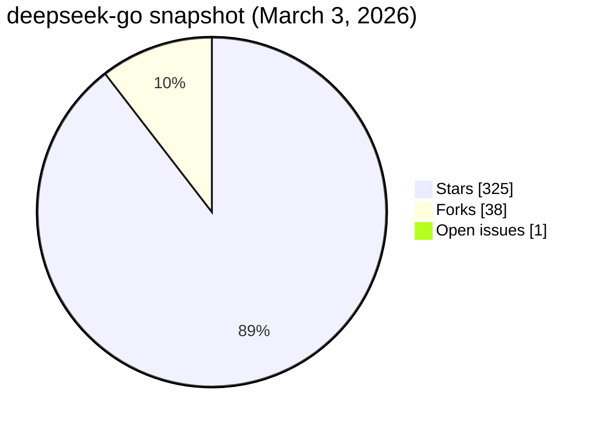
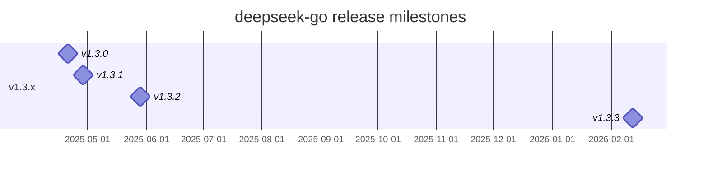

# Creating the Most Popular Deepseek API Client in Go (Part 3): Growth, Stats, and OSS Momentum

This is the part I care about the most: the project stopped being "my code" and became a community-maintained package.

I pulled the stats snapshot on **March 3, 2026** from the GitHub API and open-source stats tools.

## Snapshot (March 3, 2026)

- Stars: **325**
- Forks: **38**
- Open issues: **1**
- Latest release: **v1.3.3** (published February 12, 2026)
- Top contributor (GitHub contributions): **@Vein05 (275)**



## Trend graph (open-source stats)

I used Star History to visualize trajectory over time.

```image
src: /.netlify/images?url=/posts/images/creating-most-popular-deepseek-api-client-go-part-3/star-history.svg&w=1600&fit=cover
alt: deepseek-go star history trend chart
caption: Star growth trend for cohesion-org/deepseek-go.
layout: wide
```

## Live badges (stats at publish time)

```twoimages
src1: /.netlify/images?url=/posts/images/creating-most-popular-deepseek-api-client-go-part-3/stars-badge.svg&w=600&fit=contain
alt1: stars badge
src2: /.netlify/images?url=/posts/images/creating-most-popular-deepseek-api-client-go-part-3/forks-badge.svg&w=600&fit=contain
alt2: forks badge
justify: between
valign: middle
itemwidth: md
layout: wide
caption: Shields.io badges included in the analytics snapshot.
```

```image
src: /.netlify/images?url=/posts/images/creating-most-popular-deepseek-api-client-go-part-3/contributors-badge.svg&w=800&fit=contain
alt: contributors badge
caption: Contributor count badge from Shields.
layout: narrow
```

## Release cadence and confidence building

The growth was not just stars. Release consistency drove trust.

Recent visible milestones:

- `v1.3.0` (April 20, 2025): Ollama integration and supporting tests/docs.
- `v1.3.1` (April 28, 2025): stronger client/error handling.
- `v1.3.2` (May 28, 2025): docs and feature refinements.
- `v1.3.3` (February 12, 2026): function/tooling improvements + new contributors.



## What growth changed in my engineering priorities

When a package reaches this level of adoption, priorities shift:

1. Backward compatibility gets heavier weight than elegant rewrites.
2. Error messages become part of the public API.
3. Documentation quality starts affecting issue volume directly.
4. Test stability matters as much as feature velocity.

I started treating each release note as an operational artifact, not just a changelog.

## Tools I used for this analysis

- **GitHub API** for factual repo stats and release metadata.
- **Star History** for star growth charting.
- **Shields.io** for visual metric badges.

These are all open-source-friendly ecosystem tools that make maintainer reporting practical.

---

In Part 4, I’ll close the series with contributor acknowledgments, hard lessons, and my technical roadmap for deepseek-go.
