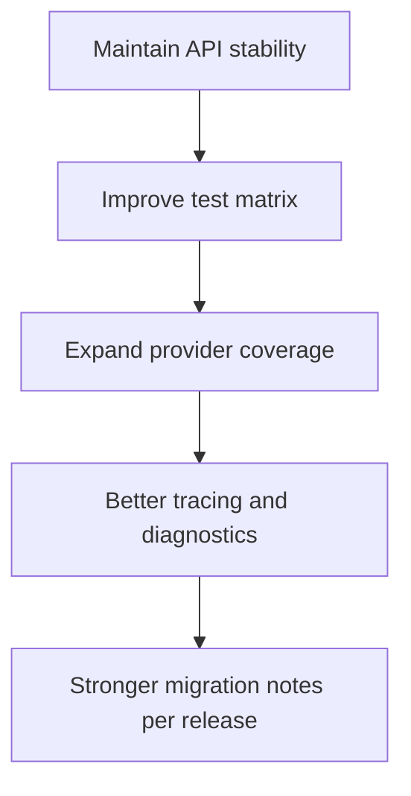

# Creating the Most Popular Deepseek API Client in Go (Part 4): Contributors, Lessons, and Roadmap

This final part is the most personal one.

A project like `deepseek-go` can start with one developer, but it does not scale with one perspective.
The quality jump happened when people I did not know started testing edge cases, proposing fixes, and improving docs.

## Contributors I want to thank

As of March 3, 2026, top contributors include:

- @Vein05
- @saphalpdyl
- @Dieg0Code
- @For-ACGN
- @xgfone
- @Prashant-koi
- @S-Sigdel
- @Yvan0329
- @janbodnar
- @fanmingyu-fmy
- @frankz61
- @prabinb19
- @advitiya0201

Thank you all. Many improvements in v1.3.x are direct outcomes of your pull requests and review feedback.

## The hardest engineering lessons I learned

### 1. SDKs are "API products," not helper libraries

If users depend on your types and error behavior, every change carries product-level impact.
I started versioning and release-writing with that responsibility in mind.

### 2. Error clarity is a feature

A lot of support churn disappears when errors explain context clearly:

- which endpoint was hit,
- whether auth, request shape, or provider mismatch failed,
- what users should try next.

### 3. Streaming is where design quality gets exposed

Batch requests can hide architectural flaws. Streaming cannot.
Any ambiguity in lifecycle, buffering, or cancellation shows up immediately under load.

### 4. Good docs reduce maintenance cost

Detailed examples (chat, stream, JSON, providers, Ollama, FIM) were not just "nice-to-have." They reduced repetitive issue traffic and helped new users succeed quickly.

## The roadmap I care about next



Concrete areas I want to push:

1. Better diagnostics around provider compatibility mismatches.
2. Expanded structured-output workflows and validation hooks.
3. More examples for production observability patterns.
4. Contributor docs for faster first PR onboarding.

## Personal closing note

When I wrote the first versions, I was optimizing for "works for me."
Now I optimize for "works for maintainers and users I may never meet."

That shift changed how I write code, tests, docs, and release notes.

If this series helps someone build a better Go SDK, then it did its job.

```image
src: /.netlify/images?url=/posts/images/creating-most-popular-deepseek-api-client-go-part-4/deepseek-go-big.png&w=1200&fit=cover
alt: deepseek-go project logo
caption: Thank you to every contributor who helped deepseek-go become a stronger Go package.
layout: wide
```

## Data + references

- Repository: [cohesion-org/deepseek-go](https://github.com/cohesion-org/deepseek-go)
- Releases: [GitHub Releases](https://github.com/cohesion-org/deepseek-go/releases)
- Star trend: [Star History](https://www.star-history.com/#cohesion-org/deepseek-go&Date)
- Badges and repo metrics visuals: [Shields.io](https://shields.io/)

