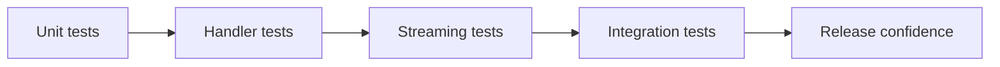

# Creating the Most Popular Deepseek API Client in Go (Part 5): My Testing Strategy in Go

When `deepseek-go` started getting real users, testing stopped being optional and became the main way I could ship quickly without breaking trust.

This is the exact testing shape I rely on.

## Test layers I use

1. Unit tests for request/response transformations.
2. Behavior tests for client configuration and error paths.
3. Streaming tests for chunk handling and EOF behavior.
4. Integration tests for live API behavior (when keys/env are present).



## My test file organization

In `deepseek-go`, I keep tests focused by domain:

- `client_test.go`
- `chat_test.go`
- `chat_stream_test.go`
- `models_test.go`
- `balance_test.go`
- `tokens_test.go`
- `json_test.go`
- `fim_test.go`
- `requestHandler_test.go`
- `responseHandler_test.go`
- `utils/requestBuilder_test.go`

This keeps regressions easy to locate.

## How I run tests locally

```bash
go test -v ./...
go test -v -short ./...
go test -v -race ./...
go test -v -coverprofile=coverage.txt -covermode=atomic ./...
go tool cover -html=coverage.txt
```

## Test environment helper I rely on

I also keep a dedicated test env utility so setup is consistent across test files:

- `internal/testutil/env.go`
- Raw source: `https://raw.githubusercontent.com/cohesion-org/deepseek-go/refs/heads/main/internal/testutil/env.go`

That helper centralizes env loading/validation for tests, which avoids repeating setup logic and reduces flaky behavior when running API-dependent test suites.

Key behaviors in `env.go`:

- Loads `.env` (optional) via `godotenv.Load()`.
- Uses `TEST_DEEPSEEK_API_KEY` first, then falls back to `DEEPSEEK_API_KEY`.
- Defaults timeout to `30s`, but allows `TEST_TIMEOUT` override (for example, `1m`).
- Skips API-dependent tests when no key is present instead of hard-failing.
- Supports short-mode skips through `SkipIfShort(t)`.

One caveat I explicitly watch for: `LoadTestConfig` defers `os.Unsetenv(\"TEST_DEEPSEEK_API_KEY\")` and `os.Unsetenv(\"TEST_TIMEOUT\")`. That keeps tests isolated, but it can surprise other tests if they assume those env vars remain set after config loading.

## FAQ: How should I handle docs.go in a Go package?

I treat `docs.go` as the package's landing page for `pkg.go.dev`.

My pattern:

1. Put a package-level comment in `docs.go` that explains what the package does in 2-4 sentences.
2. Include a short \"quick start\" snippet with realistic defaults.
3. Link to advanced examples (streaming, providers, JSON mode, testing).
4. Keep this file stable and update it every release when behavior changes.

Minimal pattern:

```go
// Package deepseek provides a typed Go client for DeepSeek-compatible APIs.
// It supports chat completions, streaming, JSON extraction, and provider-specific endpoints.
// See examples in the repository for end-to-end usage patterns.
package deepseek
```

## FAQ: How do I optimize documentation for pkg.go.dev?

The improvements that mattered most for me:

- Make the **first sentence** of package comments precise; `pkg.go.dev` indexes it for search snippets.
- Add comments for every exported type, func, and const group.
- Add runnable `Example...` tests for common user flows.
- Keep README and package docs aligned so users do not see contradictory setup steps.
- Prefer stable, tagged releases because versioned docs are easier to trust and cite.

## FAQ: Beginner maintainer mistakes I wish I avoided earlier

1. Shipping undocumented breaking changes in minor versions.
2. Changing env var names without transition/deprecation windows.
3. Assuming stream behavior is \"obvious\" without examples.
4. Using inconsistent error formats across methods.
5. Forgetting retraction flow when a bad version is published.

For bad releases, use `retract` in `go.mod` and publish a new version so tooling and users get a clear signal.

## Practical test patterns I use

### 1. Request shape validation

I verify serialized request payloads for:

- model routing,
- stop tokens,
- response format options,
- JSON mode toggles,
- provider-specific edge cases.

### 2. Stream loop correctness

I specifically test stream loops for:

- EOF handling,
- partial chunk accumulation,
- malformed chunk failure,
- explicit `Close()` behavior.

```go
for {
    resp, err := stream.Recv()
    if errors.Is(err, io.EOF) {
        break
    }
    if err != nil {
        t.Fatalf("stream error: %v", err)
    }
    // assert delta chunks
}
```

### 3. Error envelope consistency

I test that errors are mapped predictably so users can branch on real failure classes instead of parsing random strings.

## What changed when contributors joined

As contributors started submitting PRs, I tightened quality gates around:

- race detection,
- test reproducibility,
- clearer failing messages,
- coverage for recently touched behavior.

That let us merge faster while preserving release stability.

## Personal rule for SDK testing

For SDKs, tests are not just correctness checks. They are compatibility guarantees.

If a test fails after a change, I assume I may have broken someone else's production path, even if my own examples still pass.

---

Next part is Ollama integration: why I added it, where API shape differs from OpenAI-style providers, and how I handled those differences in `deepseek-go`.
