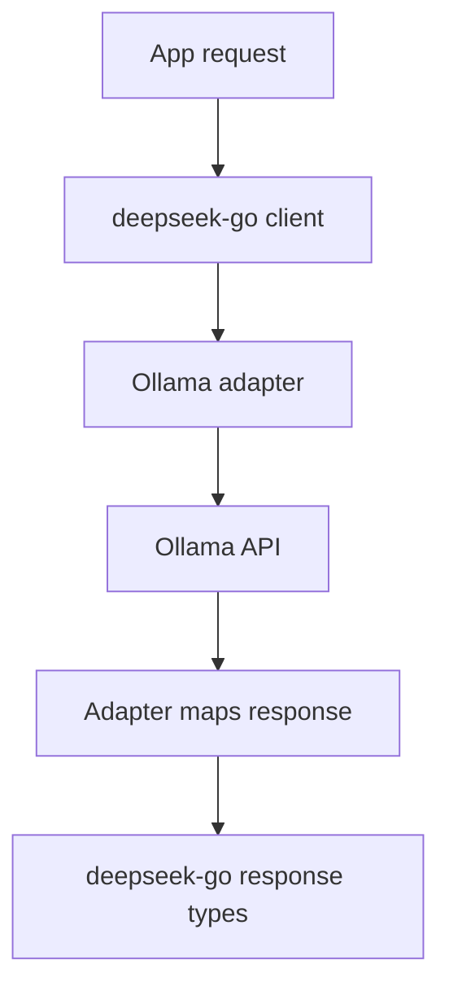

# Creating the Most Popular Deepseek API Client in Go (Part 6): Ollama Integration

Adding Ollama support was one of the most requested features, and it forced me to design for real API differences instead of assuming everything behaves like OpenAI-compatible endpoints.

## Why I added Ollama

Users wanted to run local models with the same SDK ergonomics they were already using for hosted providers.

That meant I needed:

- local-first endpoint support,
- compatibility adapters,
- stream behavior that still felt consistent,
- clear docs about limitations.

## The core integration approach

I added a dedicated Ollama path and conversion utilities rather than overloading the standard provider path with hidden branching.



This keeps user-facing types stable while still respecting Ollama-specific response behavior.

## Example integration shape

```go
client := deepseek.NewClient("", "http://localhost:11434/")

req := &deepseek.OllamaChatCompletionRequest{
    Model: "deepseek-r1:latest",
    Messages: []deepseek.ChatCompletionMessage{
        {Role: deepseek.ChatMessageRoleUser, Content: "Explain goroutines in one paragraph."},
    },
}

resp, err := client.CreateOllamaChatCompletion(context.Background(), req)
if err != nil {
    log.Fatalf("ollama error: %v", err)
}
fmt.Println(resp.Choices[0].Message.Content)
```

## Streaming with local models

Local streaming quality can vary by machine/network/runtime settings, so I focused on resilience:

- safe incremental reads,
- robust EOF behavior,
- clean cancellation/close semantics,
- response conversion that does not drop partial content.

## Limitations I documented clearly

I made sure to call out that Ollama does not fully mirror OpenAI policy/spec behavior, so there are edge differences users should expect.

Clear docs here reduced bug reports that were actually spec mismatches.

## Release impact

Ollama support landed as a major release milestone (`v1.3.0`) with:

- new integration code,
- tests,
- dedicated docs/examples,
- explicit messaging about experimental status.

That release was a turning point for adoption among local-model users.

## FAQ: How do I version provider integrations without breaking users?

My rule:

- Provider integration additions go in minor versions (`v1.x.0`).
- Behavior fixes that do not change API contracts go in patch versions (`v1.3.x`).
- Breaking request/response shape changes require a new major (`v2+` path strategy).

That keeps upgrade risk predictable for teams pinning versions.

## FAQ: Should I keep provider docs only in README?

No. I keep provider docs in three places:

1. README quick links for discovery.
2. Package-level docs/examples for `pkg.go.dev`.
3. Dedicated example files for copy-paste execution.

This reduces the gap between \"search result docs\" and \"working local code.\"

## Personal takeaway

Ollama integration taught me a big maintainer lesson: compatibility layers should be explicit.

Trying to hide provider differences with magic feels convenient short-term, but explicit adapters are easier to debug, document, and maintain long-term.

---

This wraps the deepseek-go series. If you’re building your own Go SDK, design for maintainability first, because adoption amplifies every architectural decision.
