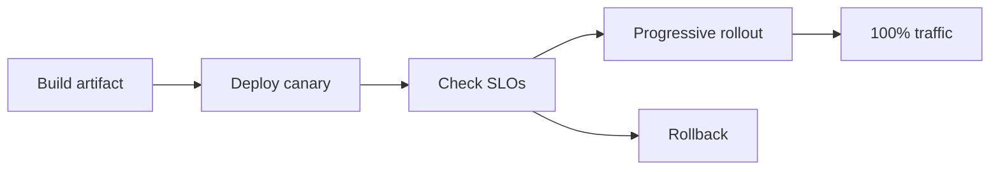

# Getting Started with Go for Web Services (Part 3): Testing, Deployment, Scaling

Part 3 closes the series with quality gates, release strategy, and scale patterns.

## Testing pyramid for Go APIs

1. Unit tests for service logic.
2. Integration tests for DB/repository behavior.
3. Contract tests for external APIs.
4. End-to-end smoke tests after deploy.

```go
func TestCreateUser(t *testing.T) {
    store := newFakeStore()
    svc := NewUserService(store)

    got, err := svc.Create(context.Background(), CreateUserInput{Email: "a@b.com"})
    if err != nil {
        t.Fatalf("unexpected err: %v", err)
    }
    if got.Email != "a@b.com" {
        t.Fatalf("unexpected email: %s", got.Email)
    }
}
```

## Deployment safety checks

Deploy pipeline should block on:

- `go test ./...`
- static analysis (`go vet`, lint)
- migration checks
- container scan
- smoke test in staging

## Zero-downtime release model



## Horizontal scale and bottlenecks

Scale sequence to follow:

1. Fix hot queries and N+1 patterns.
2. Add caching where read-heavy.
3. Queue background work.
4. Then add replicas.

```twoimages
src1: /posts/images/placeholders/go-guide-placeholder.svg
alt1: Placeholder for before optimization trace
src2: /posts/images/placeholders/go-guide-placeholder.svg
alt2: Placeholder for after optimization trace
justify: end
valign: end
itemwidth: md
layout: wide
caption: Placeholder pair: before/after latency traces.
```

## When Python still belongs in the stack

In mature systems, Python can remain useful for:

- offline analytics and ML pipelines
- experimentation workloads
- rule iteration before Go hardening

Keep serving path latency-critical code in Go, and treat Python as adjacent tooling unless requirements dictate otherwise.

## Final production checklist

- Timeouts everywhere
- Idempotency keys for unsafe retries
- Backpressure and rate limits
- Budgeted SLOs with alerting
- Disaster recovery runbook
