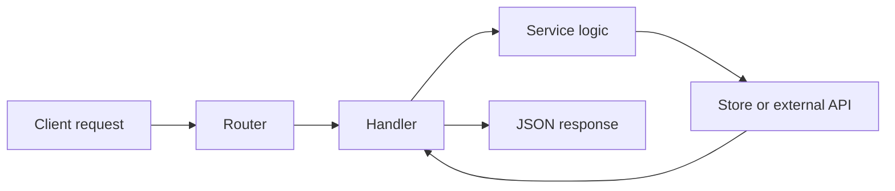

# Getting Started with Go for Web Services (Part 1): Foundations

Go is great for backend systems because it gives you a clean standard library, predictable performance, and a concurrency model that stays readable as systems grow.

This guide is written as a practical series for building production-minded web services:

1. **Part 1 (this page):** foundations, project setup, HTTP basics, configuration, and error handling.
2. **Part 2:** data layer, API design, middleware, auth, and observability.
3. **Part 3:** testing strategy, deployment, and scaling patterns.

```textandimage
title: Roadmap for the Go Web Services Series
text: This is a **multi-page guide** so you can move from basics to production step-by-step without losing context.

Use this placeholder image for now; later you can replace it with a roadmap visual or architecture sketch.
src: /posts/images/placeholders/go-guide-placeholder.svg
alt: Go guide roadmap placeholder
position: right
valign: middle
layout: wide
caption: Placeholder: replace with series roadmap graphic.
```

## Why Go for Web APIs?

When your API traffic grows, your bottlenecks are rarely only CPU speed. You usually fight complexity: race conditions, unclear error paths, unstable configs, and weak observability.

Go helps because:

- Compilation catches a lot early.
- The type system is simple enough to stay readable.
- Goroutines/channels make concurrent work straightforward.
- The runtime and tooling (`go test`, pprof, trace) are battle-tested.

## Install and verify your environment

```bash
go version
go env GOPATH GOMOD
```

Target Go 1.22+ for this guide.

## Project layout that scales

Start with a layout that can grow without becoming ceremony-heavy.

```text
my-go-service/
  cmd/api/main.go
  internal/config/config.go
  internal/httpserver/router.go
  internal/handlers/health.go
  internal/domain/
  internal/store/
  pkg/
  go.mod
```

- `cmd/api`: app entrypoint and wiring.
- `internal/*`: app internals (non-importable outside module).
- `pkg/*`: optional reusable public packages.

## Build your first server correctly

```go
package main

import (
    "context"
    "log"
    "net/http"
    "os"
    "os/signal"
    "syscall"
    "time"
)

func main() {
    mux := http.NewServeMux()
    mux.HandleFunc("/healthz", func(w http.ResponseWriter, r *http.Request) {
        w.Header().Set("Content-Type", "application/json")
        w.WriteHeader(http.StatusOK)
        _, _ = w.Write([]byte(`{"status":"ok"}`))
    })

    srv := &http.Server{
        Addr:              ":8080",
        Handler:           mux,
        ReadTimeout:       5 * time.Second,
        ReadHeaderTimeout: 2 * time.Second,
        WriteTimeout:      10 * time.Second,
        IdleTimeout:       60 * time.Second,
    }

    go func() {
        log.Printf("listening on %s", srv.Addr)
        if err := srv.ListenAndServe(); err != nil && err != http.ErrServerClosed {
            log.Fatalf("server failed: %v", err)
        }
    }()

    stop := make(chan os.Signal, 1)
    signal.Notify(stop, syscall.SIGINT, syscall.SIGTERM)
    <-stop

    ctx, cancel := context.WithTimeout(context.Background(), 10*time.Second)
    defer cancel()

    if err := srv.Shutdown(ctx); err != nil {
        log.Printf("graceful shutdown failed: %v", err)
    }
}
```

That single setup avoids many real-world issues: hanging sockets, abrupt shutdowns, and blocked deployments.

## Request lifecycle



## Configuration without chaos

A practical rule: environment variables for runtime config, defaults for local dev, and hard fail on required secrets.

```go
type Config struct {
    Port        string
    Environment string
    DBURL       string
}

func LoadConfig() Config {
    cfg := Config{
        Port:        getEnv("PORT", "8080"),
        Environment: getEnv("APP_ENV", "development"),
        DBURL:       os.Getenv("DATABASE_URL"),
    }

    if cfg.DBURL == "" {
        log.Fatal("DATABASE_URL is required")
    }

    return cfg
}
```

## Error handling pattern to keep APIs consistent

Use a uniform error envelope.

```json
{
  "error": {
    "code": "invalid_request",
    "message": "email is required",
    "request_id": "req_123"
  }
}
```

This makes client integration and logging much easier.

## Python as an interpreter medium (before hardening in Go)

If your team experiments with business rules quickly, Python can act as an interpretation layer before freezing behavior into typed Go services.

Example workflow:

1. Prototype scoring/rules in Python notebook/service.
2. Validate output with domain experts.
3. Convert stable logic to Go package + tests.
4. Keep Python for experimentation only.

```twoimages
src1: /posts/images/placeholders/go-guide-placeholder.svg
alt1: Placeholder for Python prototype output screenshot
src2: /posts/images/placeholders/go-guide-placeholder.svg
alt2: Placeholder for equivalent Go module benchmark screenshot
justify: end
valign: bottom
itemwidth: md
layout: wide
caption: Placeholder pair: Python prototype vs Go production implementation.
```

This gives product teams speed early and reliability later.

## Image placeholders you can replace later

```image
src: /posts/images/placeholders/go-guide-placeholder.svg
alt: Placeholder for HTTP flow sequence diagram
caption: Placeholder: request/response timeline with timeout boundaries.
layout: wide
```

```image
src: /posts/images/placeholders/go-guide-placeholder.svg
alt: Placeholder for project directory screenshot
caption: Placeholder: repository tree and package boundaries.
layout: wide
```

---

If you implement only three things from this page, do these first: graceful shutdown, strict config loading, and consistent error envelopes.
