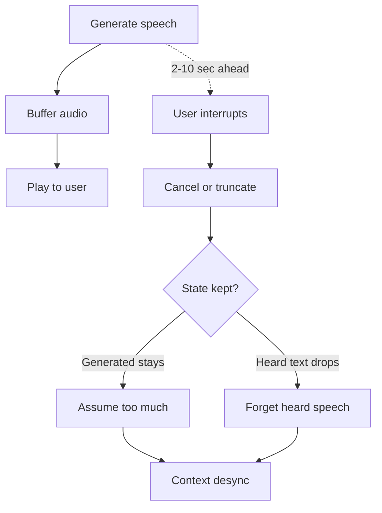
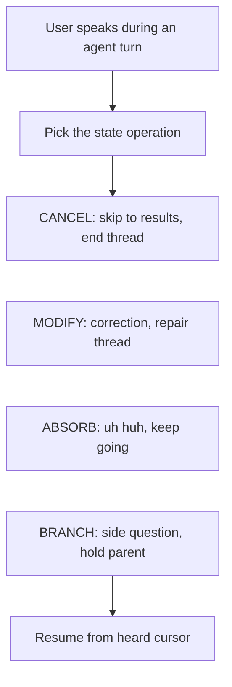

You are halfway through an explanation.

The voice agent is building toward something. Maybe it is explaining a paper. Maybe it is walking through a bug. Then one sentence catches. You interrupt:

> Wait, what's attention?

The agent answers the side question. Fine. Then you say:

> Okay, go back to where you were.

And the spell breaks.

Sometimes it starts over. Sometimes it skips ahead. Sometimes it says "as I was saying" and continues from a place you never heard. The strange part is that the model is not confused in the usual way. It did not fail to understand your words. It failed to remember the shared state of the conversation.

It does not know what actually reached your ears, or what thread should be resumed from there.

That is the failure mode this piece is about.

More precisely: voice agents can stop speaking, but most current stacks do not expose a first-class model of what was heard, what was merely generated, and what conversational thread should be resumed.

## The Go-Back Test

I do not care only whether a system claims to support barge-in. I care whether it passes the go-back test.

Here is the simplest version:

1. Ask the agent to explain something for a minute.
2. Interrupt with a side question.
3. Let it answer.
4. Say: "Okay, go back."

If it restarts, it failed.

If it skips ahead to content you never heard, it failed.

If it says "as I was saying" but has no idea where that was, it failed.

The passing behavior is specific: it should answer the side question, then resume the original explanation from the last position you actually heard.

That is not a personality feature. It is not a better prompt. It is conversation state.

## The Missing Piece Is Not Barge-In

Voice agents already know how to stop talking.

They can detect that you started speaking. They can cancel the current response. They can clear an audio buffer. They can send a new user turn to the model. Those pieces are useful, but they solve the easy half of interruption: making the system stop.

The harder half is knowing what the interruption did to the conversation.

When a human is interrupted, the old thread does not disappear. It is suspended. If I am explaining transformers and you ask "what's attention?", we both know the original explanation is still sitting there. After the side question, "go back" has a clear meaning.

Many voice AI stacks do not expose that object directly. They expose streams, buffers, cancellation, and transcript repair hooks.

So the moment you interrupt, the system has to guess which world it is in:

- Did the user hear the last sentence?
- Did the model generate it but the audio never played?
- Was this a side question, a correction, a redirect, or just "uh huh"?
- Is there something to resume?

Without those answers, "interruption" tends to become a destructive operation. The agent cancels the current response and starts a new turn. That feels responsive in the moment, but it can quietly corrupt the conversation.

## Why It Happens

The root cause is simple: generation runs ahead of playback.

The server can generate text and audio faster than the user can hear it. By the time you interrupt, the server may already have produced several seconds of speech. Some of that audio is sitting in a client buffer. Some may have been sent over the network. Some may be committed to conversation state.

But you did not hear it.

That creates two timelines:

- **Generated timeline:** what the model already produced.
- **Heard timeline:** what actually reached the user.



The gap between those timelines is the dangerous part. If the server keeps generated-but-unheard text in context, the next response can assume you know things you never heard. If it deletes too much, the agent can forget things you did hear. Either way, the shared conversation state drifts away from reality.

I call that drift **context desync**.

```image
src: /posts/images/every-voice-ai-forgets-what-you-heard/desync-staircase.png
alt: Context desync grows with each interruption across OpenAI Realtime, LiveKit Agents, Pipecat, and ICP
layout: wide
caption: In a five-interruption paper-explanation scenario, cancel-and-restart strategies can accumulate context drift. The exact direction differs by stack, but the user and server can stop agreeing on what was heard.
```

This is why the failure feels so uncanny. The agent is not merely losing a response. It is losing common ground.

## Evidence From Current Stacks

This problem shows up differently across frameworks. The point is not that these projects are careless. Most of them have reasonable mechanisms for barge-in, truncation, cancellation, or transcript repair.

The architectural gap is narrower and more interesting: interruption is usually exposed first as cancellation or truncation. A first-class resumable thread model is still left to the application.

### OpenAI Realtime: Truncation Solves One Layer

OpenAI's Realtime API has the clearest statement of the underlying timing issue. The docs for `conversation.item.truncate` say the server can produce audio faster than realtime, so the client uses truncation when audio has been sent but not yet played. The same docs say truncation removes the server-side text transcript so the context does not contain text the user did not hear.

That is the right concern. OpenAI Realtime exposes truncation to prevent generated-but-unheard content from remaining in context. But the abstraction is still item/audio truncation rather than a first-class heard cursor plus a resumable thread model.

In the reference `openai-realtime-api-beta` conversation handler, truncation does this:

```javascript
'conversation.item.truncated': (event) => {
  const { item_id, audio_end_ms } = event;
  const item = this.itemLookup[item_id];
  const endIndex = Math.floor((audio_end_ms * this.defaultFrequency) / 1000);
  item.formatted.transcript = '';
  item.formatted.audio = item.formatted.audio.slice(0, endIndex);
  return { item, delta: null };
}
```

The relevant line is:

```javascript
item.formatted.transcript = '';
```

That is a conservative move: avoid keeping text the user may not have heard. But an application that wants a transcript, a text history, or a resumable parent thread still has to build extra machinery. The system knows where the audio was cut. It does not, by itself, expose "the parent explanation is suspended at this heard cursor."

The community reports show why that boundary matters. One developer reported that the transcript could contain "5-10 seconds" the user did not hear, making the next response feel disjointed. Another asked whether they were really supposed to delete the entire assistant text after `TRUNCATE`, then described the workaround: truncate the audio, re-transcribe the remaining audio, and rewrite the assistant message.

That is a lot of machinery to recover the most basic fact in a voice conversation: what did the user hear?

### LiveKit: Repairing Heard History Is Hard

LiveKit is explicit about the right target. Its current docs describe truncating conversation history to the portion of speech the user heard.

The interesting evidence is LiveKit issue #5038, because it shows how easy the bookkeeping can be even when the target is correct. The report describes a case where the user heard part of a response, but the response never made it into `chat_ctx`.

The core cleanup path in the report comes down to this:

```python
else:
    forwarded_text = ""
```

That branch overwrote generated text when the first audio frame future had not resolved. The reported result: no `conversation_item_added` event, no committed assistant message, and a conversation history that forgot speech the user heard.

One failure mode can make the agent believe you heard too much. The LiveKit report shows the opposite: the agent can lose speech the user did hear.

Both are context desync.

### Pipecat: Interruption Is A Stop Signal

Pipecat makes the design gap visible in one small class:

```python
@dataclass
class InterruptionFrame(SystemFrame):
    """Frame pushed to interrupt the pipeline."""
    pass
```

That frame can interrupt a pipeline. It is not trying to say where the audio stopped, what was heard, or whether the interruption was a side question, correction, redirect, or backchannel.

That is not a criticism of the class by itself. A pipeline frame should be small. The design question is what surrounds it. If the surrounding system never adds heard state and interruption disposition, then all interruption types collapse into the same event.

Pipecat issue #2791 described the practical result: interrupt a counting bot after "5", and the partial spoken text may not be added to LLM context, so the next turn starts over as if the spoken part never happened.

Again, the problem is not audio cancellation. The problem is the shared state model above cancellation.

### Vocode: Fast Cancellation, Not Resume Semantics

Vocode has the same broad shape. Its interruption path broadcasts interrupts, calls the output device interruption, cancels the current agent task, and cancels response workers.

That is a reasonable way to stop a voice pipeline quickly. It is not a resume model. It does not expose a first-class notion of "hold this explanation at the heard cursor, answer the child question, then return."

The stack stops. A resumable parent thread is left to application code.

## The Pattern

Once you look across the implementations, a common abstraction boundary is visible:

> An interruption is primarily a cancellation or truncation event.

But that is only sometimes true.



Treating all four as the same event is the abstraction gap.

Humans do not do this. If I ask a side question, you do not discard the original explanation. You hold it in working memory. After the side question resolves, you resume with a tiny bridge:

> Right. So as I was saying, each attention head learns a different relation...

That bridge only works because both people know where the parent thread was suspended.

Voice agents need the same state operation.

## What Fixing It Looks Like

I built Interupt around a small protocol idea: interruption should not only be a stop signal. It should be a state transition.

The protocol has three pieces.

First, the server tracks what was actually heard. The client sends playback heartbeats with the current audio cursor. When an interruption arrives, the server trusts the playback cursor, not the generation head.

Second, the interruption gets typed. A side question is `BRANCH`. A correction is `MODIFY`. A redirect is `CANCEL`. A backchannel is `ABSORB`. These are not labels for analytics. They decide what happens to conversation state.

Third, the conversation becomes a tree. A branch holds the parent thread, creates a child thread, answers the child, then resumes the parent from the last confirmed heard position.

```image
src: /posts/images/every-voice-ai-forgets-what-you-heard/icp-infographic.png
alt: Side-by-side comparison of cancel-and-restart interruption handling and ICP protocol handling
layout: wide
caption: The same side question under cancel-and-restart versus ICP. The important move is not the classification label; it is holding the parent thread at the heard cursor instead of discarding it.
```

In the demo, that state is visible. The orb changes color when the agent branches. The answer happens in the child thread. Then the parent resumes from where playback was confirmed, not from where generation had raced ahead.

That is the behavior I want voice-agent stacks to make easy.

## The Tradeoff

ICP is not free.

Playback heartbeats can be stale. In my current setup, the server can be about one segment behind the user's actual playback position. That means the agent may replay a little. I prefer that failure mode. Repeating one sentence is much less damaging than skipping something the user never heard.

Typed interruption also adds classification latency. In my evaluation, I model it as about 200ms. For a side question, that is worth it. For obvious UI-driven actions, a client can send a disposition hint and avoid most of the delay.

The bigger cost is architectural. A voice agent has to stop treating conversation history as a flat list of completed messages. It needs a live representation of conversational focus: what is active, what is held, what was heard, and what can be resumed.

That sounds heavier until you compare it with the alternative: every interruption can move the system into a different conversation than the one the user experienced.

## Links

The protocol spec is here: [ICP wire protocol](https://github.com/Vein05/icp-protocol/blob/main/icp-wire-protocol.md) and [conversation model](https://github.com/Vein05/icp-protocol/blob/main/icp-conversation-model.md).

I will add the Interupt code repo, paper PDF, demo video, and Discord link here when they are public.

## Sources

- [OpenAI Realtime API reference: `conversation.item.truncate`](https://platform.openai.com/docs/api-reference/realtime-client-events/conversation/item/truncate)
- [OpenAI reference client: `conversation.js`](https://github.com/openai/openai-realtime-api-beta/blob/main/lib/conversation.js)
- [OpenAI Developer Community: interruptions do not properly trim transcript](https://community.openai.com/t/realtime-api-interruptions-dont-properly-trim-the-transcript/1000703)
- [OpenAI Developer Community: should truncate delete the entire response text?](https://community.openai.com/t/when-truncate-is-received-are-we-really-meant-to-delete-the-entire-response-text-or-just-what-had-not-been-heard-by-the-client/1259022)
- [OpenAI Developer Community: truncating realtime audio transcriptions](https://community.openai.com/t/truncating-realtime-audio-transcriptions/970642)
- [LiveKit Agents docs: interruptions](https://docs.livekit.io/agents/build/turns/)
- [LiveKit issue #5038](https://github.com/livekit/agents/issues/5038)
- [Pipecat `InterruptionFrame`](https://github.com/pipecat-ai/pipecat/blob/main/src/pipecat/frames/frames.py)
- [Pipecat issue #2791](https://github.com/pipecat-ai/pipecat/issues/2791)
- [Vocode core](https://github.com/vocodedev/vocode-core)
