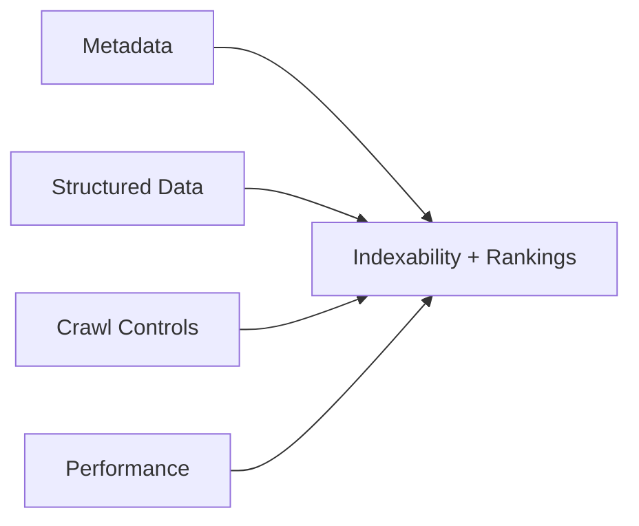
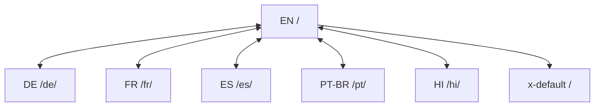
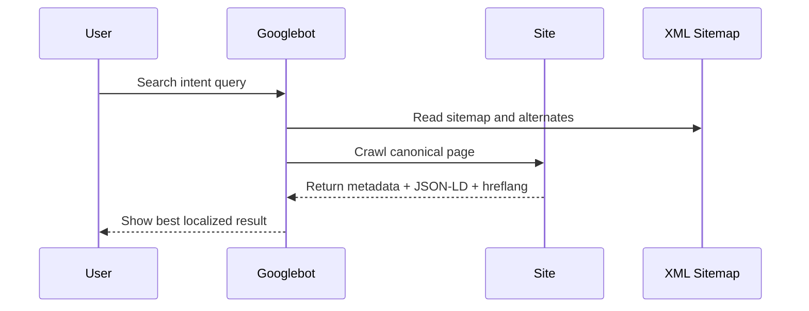
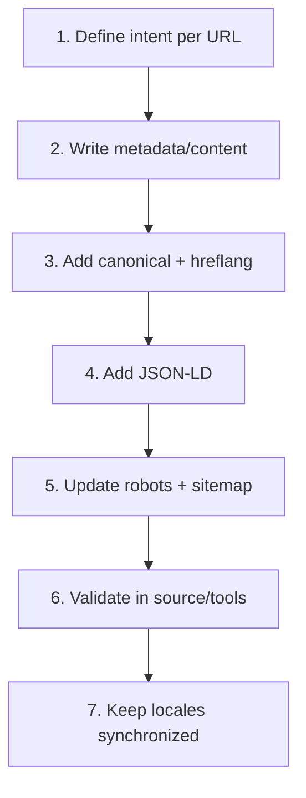
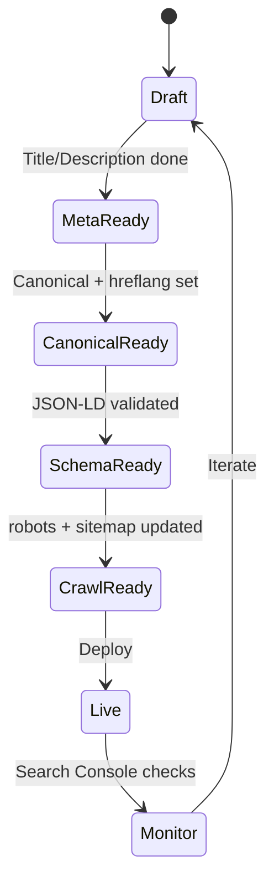
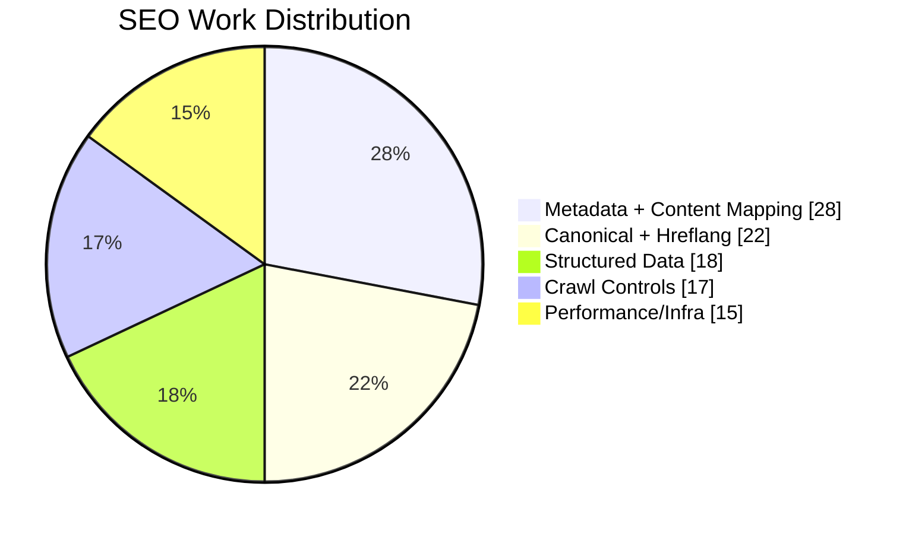

This is a practical write-up of the SEO work I implemented for [playimposter.xyz](https://www.playimposter.xyz/), a browser-based social deduction party game.

The goal was straightforward: rank for high-intent game queries, improve index coverage across languages, and make my pages understandable to both search engines and social crawlers.

Instead of treating SEO as one tag or one tool, I handled it as a full system:

- page-level metadata quality,
- canonicalization,
- multilingual indexing,
- structured data,
- crawl guidance,
- technical performance and caching,
- stable internal linking and information architecture.



## Why this project needed serious SEO

`playimposter.xyz` is in a crowded space. People search for:

- "imposter word game",
- "party game no download",
- "social deduction game online",
- "how to play imposter game",
- and language-localized versions of those same intents.

If the site does not clearly communicate relevance and page purpose, search engines cannot confidently rank it, even if the product is good.

So I built SEO into every content surface: home, FAQ, setup, settings, history, and localized routes.

## 1. Keyword-targeted titles and descriptions by page intent

I rewrote each important page title and meta description based on search intent, not generic branding.

Examples:

- Homepage title targets transactional and informational intent:
  `Imposter Word Game Online – Free Party Game with Word Pairs | Play Now`
- FAQ page title targets question intent:
  `FAQ – Imposter Word Game | How to Play, Rules & Tips`
- Setup page title targets in-product onboarding intent:
  `Set Up Imposter Game – Choose Players, Words & Roles`

This gave each URL a distinct search purpose instead of duplicated metadata.

```html
<title>Imposter Word Game Online - Free Party Game with Word Pairs | Play Now</title>
<meta
  name="description"
  content="Play the free Imposter word game online. No download, no signup, and optimized for mobile parties."
/>
<meta name="robots" content="index, follow" />
```

## 2. Canonical tags on every core page

I implemented canonical URLs to make preferred indexing explicit and reduce duplicate-content ambiguity.

Examples:

- Home: `https://www.playimposter.xyz/`
- FAQ: `https://www.playimposter.xyz/faq.html`
- Localized home: `https://www.playimposter.xyz/de/`, `/fr/`, `/es/`, `/pt/`, `/hi/`

Canonicalization is especially important in multilingual sites with similar templates.

```html
<link rel="canonical" href="https://www.playimposter.xyz/" />
<link rel="alternate" hreflang="en" href="https://www.playimposter.xyz/" />
<link rel="alternate" hreflang="de" href="https://www.playimposter.xyz/de/" />
<link rel="alternate" hreflang="fr" href="https://www.playimposter.xyz/fr/" />
<link rel="alternate" hreflang="es" href="https://www.playimposter.xyz/es/" />
<link rel="alternate" hreflang="pt-BR" href="https://www.playimposter.xyz/pt/" />
<link rel="alternate" hreflang="hi" href="https://www.playimposter.xyz/hi/" />
<link rel="alternate" hreflang="x-default" href="https://www.playimposter.xyz/" />
```

## 3. Full multilingual SEO with hreflang clusters

A key part of this optimization was international discoverability.

I shipped alternate language versions with `hreflang` on key pages and mirrored these relationships in the sitemap.

Implemented language routes:

- English (`/`)
- German (`/de/`)
- French (`/fr/`)
- Spanish (`/es/`)
- Portuguese Brazil (`/pt/` with `pt-BR` hreflang)
- Hindi (`/hi/`)

I also included `x-default` to guide fallback behavior.

This helps Google serve the right language page per user locale and reduces cross-language cannibalization.





## 4. Structured data for richer SERP understanding

I added JSON-LD schema where it mattered most.

### `WebApplication` schema on homepage

Homepage includes `WebApplication` data that declares:

- app name and description,
- game category/genre,
- operating system compatibility (`Any`),
- free pricing (`Offer` price `0`),
- keywords and language.

This helps search engines classify the site as an interactive game product, not just a static article.

### `FAQPage` schema on homepage and FAQ page

I added FAQ structured data covering common user questions such as:

- player count,
- how the game works,
- mobile compatibility,
- free/no-signup/no-download concerns,
- gameplay mechanics like word pairs.

These FAQ entities improve topical coverage and can support richer search result presentation.

```json
{
  "@context": "https://schema.org",
  "@type": "WebApplication",
  "name": "Imposter - Free Online Word Party Game",
  "applicationCategory": "Game",
  "offers": {
    "@type": "Offer",
    "price": "0",
    "priceCurrency": "USD"
  },
  "inLanguage": "en"
}
```

```json
{
  "@context": "https://schema.org",
  "@type": "FAQPage",
  "mainEntity": [
    {
      "@type": "Question",
      "name": "How many players do you need for Imposter?",
      "acceptedAnswer": {
        "@type": "Answer",
        "text": "3 to 20 players. Best with 5-10."
      }
    }
  ]
}
```

## 5. Robots and crawl directives

I configured `robots.txt` to explicitly allow crawling for main and language paths and to expose the sitemap URL:

- Allow `/`
- Allow `/de/`, `/fr/`, `/es/`, `/pt/`, `/hi/`
- Declare sitemap at `https://www.playimposter.xyz/sitemap.xml`

At the page level, important URLs include `meta name="robots" content="index, follow"` to reinforce indexability intent.

```txt
User-agent: *
Allow: /
Allow: /de/
Allow: /fr/
Allow: /es/
Allow: /pt/
Allow: /hi/

Sitemap: https://www.playimposter.xyz/sitemap.xml
```

## 6. XML sitemap with hreflang alternates

I built a sitemap that does more than list URLs. It includes:

- core English URLs,
- localized counterparts,
- `xhtml:link` alternates for language mapping,
- page priorities and change frequencies.

This gives search engines cleaner discovery and better language clustering for both homepage and FAQ surfaces.

```xml
<url>
  <loc>https://www.playimposter.xyz/faq.html</loc>
  <xhtml:link rel="alternate" hreflang="en" href="https://www.playimposter.xyz/faq.html" />
  <xhtml:link rel="alternate" hreflang="de" href="https://www.playimposter.xyz/de/faq.html" />
  <xhtml:link rel="alternate" hreflang="fr" href="https://www.playimposter.xyz/fr/faq.html" />
  <xhtml:link rel="alternate" hreflang="es" href="https://www.playimposter.xyz/es/faq.html" />
  <xhtml:link rel="alternate" hreflang="pt-BR" href="https://www.playimposter.xyz/pt/faq.html" />
  <xhtml:link rel="alternate" hreflang="hi" href="https://www.playimposter.xyz/hi/faq.html" />
  <xhtml:link rel="alternate" hreflang="x-default" href="https://www.playimposter.xyz/faq.html" />
</url>
```

## 7. Social metadata for better distribution

Search is not the only discovery channel, so I standardized share metadata:

- Open Graph (`og:title`, `og:description`, `og:url`, `og:image`)
- Twitter Card (`summary_large_image` + title/description/image)

This improves CTR when pages are shared in chats and social feeds, which indirectly supports traffic and search signals over time.

## 8. Technical SEO hardening in server config

I also optimized delivery and crawl efficiency at the infrastructure level via `.htaccess`.

### HTTPS enforcement

All HTTP traffic is redirected to HTTPS via `301`, consolidating authority and avoiding protocol duplication.

### Compression

Gzip enabled for HTML, CSS, JS, JSON, SVG, and manifest content types to reduce transfer size.

### Browser caching

Cache policy tuned by asset type:

- CSS/JS long cache,
- images medium cache,
- HTML short cache for content freshness.

This improves repeat-visit speed and can reduce crawl overhead.

### Security headers

Added headers like:

- `X-Frame-Options`,
- `X-Content-Type-Options`,
- `Referrer-Policy`,
- `Permissions-Policy`.

Not a direct ranking boost, but part of technical quality and reliability.

```apache
# Force HTTPS
RewriteEngine On
RewriteCond %{HTTPS} off
RewriteRule ^ https://%{HTTP_HOST}%{REQUEST_URI} [L,R=301]

# Compression
AddOutputFilterByType DEFLATE text/html text/css application/javascript application/json

# Caching
ExpiresByType text/css "access plus 1 year"
ExpiresByType application/javascript "access plus 1 year"
ExpiresByType text/html "access plus 1 hour"
```

## 9. Information architecture and internal navigation consistency

SEO is easier when site structure is predictable.

I kept consistent page routes for game flow and used shared navigation logic across language directories, including:

- `index.html`,
- `players.html`,
- `setup.html`,
- `game.html`,
- `results.html`,
- `history.html`,
- `settings.html`,
- `faq.html`.

This stabilized crawl paths and made every locale structurally parallel.

## 10. Matching content to actual search behavior

I intentionally targeted user-language search phrases around:

- "imposter word game",
- "no download",
- "no signup",
- "party game online",
- "how to play",
- "word pairs mechanic".

Those terms are reflected in title tags, descriptions, headings, and FAQ answers in a way that stays readable for humans.

The key rule I followed: write for real users first, but make page purpose machine-readable.

## Operational workflow I followed

The process was not "do SEO once and forget it."

It looked like this:

1. Define page intent and target query clusters per URL.
2. Write/adjust metadata and on-page copy for each route.
3. Add canonical + hreflang.
4. Add JSON-LD where appropriate.
5. Update robots + sitemap (with alternates).
6. Validate output manually in source.
7. Keep language routes synchronized when editing templates.

That sequence prevented partial implementations and conflicting signals.



## What this optimization changed

From an engineering perspective, this project moved from "a fun static game page" to "a structured, indexable multilingual web product."

The improvements were:

- clearer indexing signals,
- better language targeting,
- stronger coverage for informational + transactional intents,
- better social-sharing previews,
- stronger technical foundations for crawl and speed.

## Mistakes I intentionally avoided

- Duplicated page titles across routes.
- Missing canonical tags on localized pages.
- Hreflang without matching sitemap alternates.
- Schema markup that does not match visible content.
- Treating `robots.txt` as the only crawl/index control.
- Ignoring non-homepage SEO for setup/history/faq pages.

These are common SEO failures in otherwise strong indie projects.

## SEO checklist I now use for pages like this

Before shipping a new route, I verify:

- unique title and meta description,
- canonical URL correctness,
- locale alternates (`hreflang` + `x-default`) if multilingual,
- valid structured data (if relevant),
- robots/index directives,
- sitemap inclusion,
- Open Graph + Twitter fields,
- clean internal links from relevant pages,
- acceptable performance and cache headers.

That checklist keeps SEO quality consistent as the site grows.





## Useful SEO tools and submission links

When shipping SEO updates, these are the official pages I use most:

- Google Search Console: [Search Console](https://search.google.com/search-console/about)
- Submit/build sitemap guidance: [Build and submit a sitemap](https://developers.google.com/search/docs/crawling-indexing/sitemaps/build-sitemap)
- Search Console API (sitemaps): [Sitemaps API reference](https://developers.google.com/webmaster-tools/v1/sitemaps)
- Search Console API submit endpoint: [Sitemaps: submit](https://developers.google.com/webmaster-tools/v1/sitemaps/submit)
- Request recrawl/indexing: [Ask Google to recrawl your URLs](https://developers.google.com/search/docs/advanced/crawling/ask-google-to-recrawl)
- Bing Webmaster Tools: [Bing Webmaster](https://www.bing.com/webmasters)
- Bing sitemap submission help: [How to submit sitemaps](https://www.bing.com/webmasters/help/how-to-submit-sitemaps-82a15bd4)
- Bing URL submission help: [URL Submission](https://www.bing.com/webmasters/help/url-submission-62f2860b)

## FAQ: What were the most important SEO wins on playimposter.xyz?

The biggest wins were combining canonical tags, multilingual `hreflang`, structured data, and a sitemap with alternate links. Each piece alone helps, but together they create clear, non-conflicting indexing signals.

## FAQ: Why use both FAQPage schema and a visible FAQ page?

Because schema should reflect real content users can read. The dedicated `faq.html` page captures long-tail question intent, while `FAQPage` JSON-LD helps search engines parse that content more reliably.

## FAQ: Did technical server settings really matter for SEO?

Yes. HTTPS redirects, compression, and cache policies improve consistency, speed, and crawl efficiency. They are not substitutes for content relevance, but they strengthen the technical baseline that search engines evaluate.

## FAQ: Why invest in multilingual SEO this early?

The game already had real non-English usage potential. Adding proper language routing, canonicals, and hreflang early prevents future index confusion and makes international growth cleaner.

## FAQ: What should be improved next?

Next improvements should focus on performance metrics (Core Web Vitals), deeper internal linking between gameplay pages and FAQ content, and language-specific content expansion beyond translated templates.

## Final takeaway

SEO optimization on `playimposter.xyz` worked because I treated it as product infrastructure, not marketing garnish.

I aligned content intent, technical signals, and multilingual architecture so crawlers and users see the same clear story: what this game is, who it is for, and why this page should rank.
